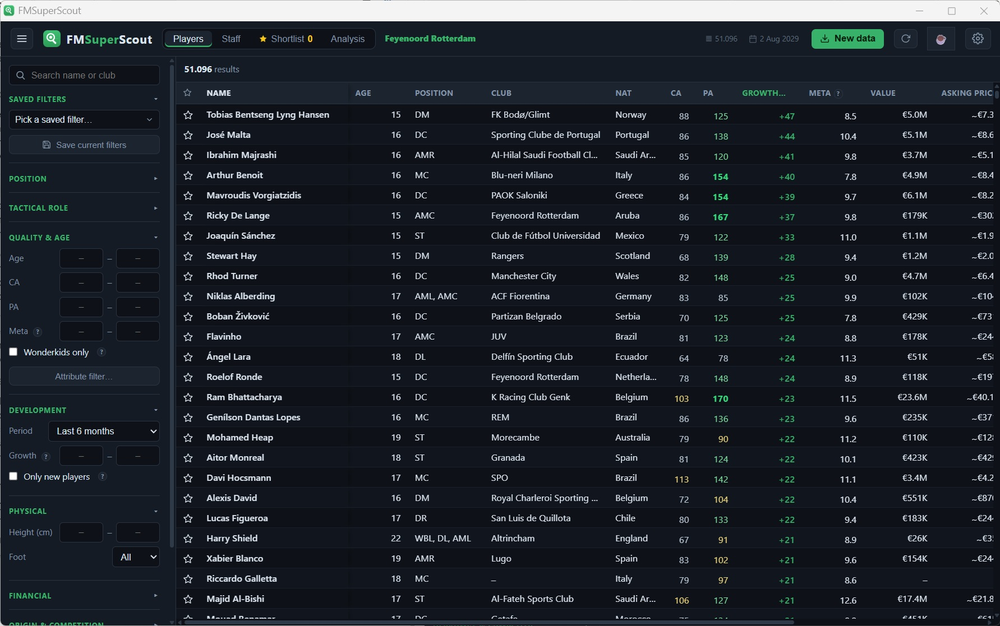
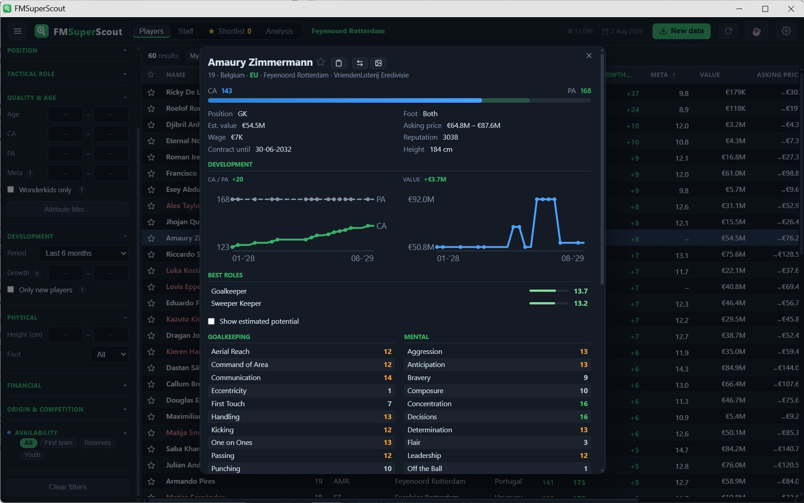

<p align="center">
  
</p>

<h1 align="center">FMSuperScout</h1>

<p align="center">A fast, open source scouting tool for <strong>Football Manager 26</strong> (Windows).</p>

<p align="center">
  <a href="https://github.com/mavarobli/FMSuperScout/releases/latest/download/FMSuperScout-Setup.exe"><strong>Download the installer</strong></a>
  ·
  <a href="CHANGELOG.md">Changelog</a>
  ·
  <a href="TROUBLESHOOTING.md">Troubleshooting</a>
</p>

---

Press **F9** in your save and the full loaded database, 45,000+ players and staff, is pulled out
of memory in about 10 seconds. Including what FM normally hides: **CA and PA**, hidden personality
attributes and FM's **real transfer value**. After that everything is instant. Monster saves work
too: 635k people across 100+ leagues loads in about 17 seconds.

Two parts: a small **BepInEx plugin** that reads the database from inside the game, and a **local
web app** where you search, filter and compare. No internet, no accounts, no ads, nothing leaves
your PC.

> Single-player use only. The plugin **only reads** memory, it never writes to the game.

<p align="center">
  
</p>
<p align="center"><sub>Sorted by growth: who gained the most CA since your chosen reference date.</sub></p>

## What it does that other tools do not

**It remembers.** Every time you press F9 the app stores a small snapshot. Nothing else reads your
save over time, and that unlocks two things no tool without memory can do:

- **Growth.** Pick a period (since your last dump, 6 months, a year, this season) and every player
  gets a number: how much CA he gained since then. Green up, red down. Sort the world by it, or
  filter on it. "Everyone who gained 10 or more CA in the last year" is one filter.
- **Intake Radar.** On youth intake day a bar tells you how many newgens appeared worldwide since
  your last dump and who the best one is. One click shows them all, sorted by potential. To a tool
  that only reads the present, a brand new 16-year-old with PA 178 looks like every other
  16-year-old.

**A meta score built on real testing.** Every player gets a 1-20 score weighted by
[FM-Arena's attribute testing](https://fm-arena.com/table/26-player-attributes-testing): what
actually wins matches in the engine. Two players with equal CA? The higher meta score usually
performs better. Goalkeepers get their own weighting, based on
[harvestgreen22's keeper attribute retest](https://fm-arena.com/thread/18816-fm24-i-re-tested-the-goalkeeper-s-attributes-using-newer-test-league/).
Next to it sits **PA meta**: the same weighting applied to the attributes a player is expected
to have at his potential, following the measured growth profile of his position group. Sort on
it to find tomorrow's meta stars.

**Shareable player cards.** One click saves a PNG in FM's own visual language: scout stars for
current and potential ability, the full attribute grid in FM colours, best roles and finances.
Wonderkids get a gold card. Built for showing off that one insane regen.

<p align="center">
  
</p>
<p align="center"><sub>A player profile, with how his ability and value moved across the save.</sub></p>

## Everything else

- **Filters that stack**: name/club, age, CA, PA, meta, PA meta, value, asking price, wage, nationality,
  EU/EEA, contract, transfer status, division (smart search), **height**, **preferred foot**, and
  a one-tick **wonderkid** filter. Pick positions on a clickable pitch.
- **Attribute filter**: min/max on any attribute ("Pace 15+"), hidden characteristics and
  personality included. Rules combine, show as removable chips and save into presets.
- **Saved presets**: the complete filter setup, positions and role, under one name.
- **Tactical role ratings**: 19 FM roles scored from the key attributes, as a sortable column and
  a "best roles" panel per player.
- **Player comparison**: up to 3 side by side with FM-style bars, hidden stats included.
- **Squad analysis**: thin depth, aging and missing succession per position group, with one click
  to scout candidates for the gap.
- **Development charts** per player: CA/PA and value over time, with the change over the period.
- **Loan-aware**: loaned players show in blue with their parent club, your own loaned-out players
  in red under the My club filter.
- **Market value from memory**: FM's actual transfer value for most players, a calibrated estimate
  for the rest (see *Accuracy*).
- **Asking price and transfer interest**: estimates from contract, transfer status, age,
  reputation gap and wages, including the FIFA under-18 rule.
- **Shortlist** (★) with its own tab and CSV export.
- **Settings**: four languages (English, Dutch, French, German), GBP/EUR/USD, and one toggle to
  hide CA/PA and all hidden stats for people who consider reading them cheating (the meta score
  has its own toggle).
- **One-click update**: the app checks for a new release about once a day and shows a dismissible
  notice, and the settings menu has a manual "Check for updates" action. One click downloads the
  installer, verifies its SHA-256 against the release and starts it. Nothing installs without
  your click, no tracking.

## Install (end users)

One installer does everything: the viewer app, the BepInEx mod layer **and** the in-game plugin.
No coding needed, nothing else to download.

1. Download **[FMSuperScout-Setup.exe](https://github.com/mavarobli/FMSuperScout/releases/latest/download/FMSuperScout-Setup.exe)**
   (or pick a version from the [Releases](https://github.com/mavarobli/FMSuperScout/releases) page).
2. Windows SmartScreen may warn about an unknown publisher, since the installer isn't code-signed.
   Click **More info → Run anyway**. Want to verify first? Check the file's SHA-256 against the
   release notes: `Get-FileHash .\FMSuperScout-Setup.exe -Algorithm SHA256`.
3. Run it. The wizard finds your FM26 folder automatically (Steam incl. extra libraries, Epic and
   Xbox/Game Pass in beta) and installs everything. Already using BepInEx for another mod? It is
   left untouched; only the plugin DLL is added.
4. Start FM26. **The first launch takes 1-3 minutes longer** and shows a black console window.
   That's normal, the mod layer is generating its bindings. Your antivirus may ask about BepInEx:
   that's the standard FM26 mod loader, allow it.
5. Load your save, press **F9**, and open **FMSuperScout** from the Start menu.

To remove it: *Apps and features* → FMSuperScout. That removes the viewer and the plugin DLL;
BepInEx stays (other mods may use it).

Something not working (no players loaded, no console window)? See
[TROUBLESHOOTING.md](TROUBLESHOOTING.md), or use **Report a problem** in the app's settings menu.

## Run from source (developers)

Requires [Node.js](https://nodejs.org) (any recent version; no dependencies to install).

```bash
node app/server.js       # then open http://localhost:8765
npm test                 # run the model tests (zero dependency, node:test)
```

Or double-click `Start FMSuperScout.cmd`. To build the standalone installer yourself (requires
Inno Setup 6 and a local FM26 install with BepInEx as the payload source):

```powershell
powershell -ExecutionPolicy Bypass -File installer/build-exe.ps1
# -> dist/FMSuperScout-Setup.exe (+ .sha256)
```

A viewer-only zip package is also available via `installer/build-package.ps1`.

The plugin is C# (BepInEx 6, IL2CPP). It builds with a standard .NET SDK:

```bash
dotnet build plugin/FMSuperScout.csproj -c Release
```

Install the built DLL by copying `plugin/bin/Release/FMSuperScout.dll` to
`<FM26>\BepInEx\plugins\` while the game is closed.

## Getting data out of Football Manager

The app reads whatever the FMSuperScout plugin last dumped from your **active save**:

1. Start FM26 and load your save.
2. Press **F9** in-game (or click **⬇ New data** in the app).
3. The data loads by itself as soon as the dump is ready. If a read fails, the app shows what
   went wrong instead of waiting forever.

Data lives in `%LOCALAPPDATA%\FMSuperScout\` (`dump*.json`, `status.json`, `diagnostics.txt`).

The setup exe installs the plugin for you. For development, `Installeer plugin.cmd` copies a
freshly built DLL into the game folder. BepInEx only *adds* files to the FM folder, so it is
fully reversible (or use Steam, Verify integrity of game files).

## Accuracy

**Read straight from memory (reliable):** name, nationality, birth year, height, foot; **CA and
PA** (the real values); all visible and hidden attributes and positions; wage, contract end,
transfer status; current club; club and player reputation; **FM's real transfer value** for most
players; staff CA/PA, attributes and role.

**Estimates (clearly labelled as such):**

- **Market value fallback**: for the minority of players where FM does not store a value, a
  log-linear model calibrated on players with a real in-game value fills the gap (saturating
  reputation curve, age, and remaining contract length). Read values are shown exactly; estimates
  are shown as a range. Method: [`docs/value-model.md`](docs/value-model.md).
- **Asking price**: the read/estimated value adjusted by contract length, transfer status
  (listed, not-for-sale, release clause), age and potential, and club reputation.
- **Potential attributes**: projects each attribute toward the player's PA. Derived from how FM's
  Current Ability works (CA is a linear, weighted sum of the attributes, so scaling toward PA is
  the profile-preserving projection), then tilted by age and attribute type so physical attributes
  fade with age while mental and technical keep improving, and capped at 20.
- **Transfer interest**: a heuristic from reputation gap (your club vs theirs and vs the player's
  own stature), wage affordability, availability, personality, age, and FIFA Article 19.

None of the estimates are exact FM numbers, but each is built on FM's dominant factors and covered
by the model tests in [`test/`](test/).

## Project structure

| Path | Contents |
|---|---|
| `app/` | Local web app (Node, zero dependencies) |
| `plugin/` | C# source of the BepInEx plugin |
| `installer/` | Icon generator, launcher, PowerShell installer, package builder |
| `test/` | Zero-dependency model tests (`npm test`) |
| `docs/` | Value model, .fmf format, release notes and backlog |

## Where this fits

FM26 has a healthy set of tools that read hidden data from memory, several of them very good and
several of them free. If you want to *edit* your save, want deep match statistics with xG and
per-90s, or want an overlay inside the game itself, other tools do those things well and this one
does not.

Pick this one for the speed, the development tracking, and because it is open source: you can read
exactly what it does with your system.

## Support

FMSuperScout is free and stays free. If it saved you an hour of squinting at slow menus, you can
[buy me a coffee](https://ko-fi.com/fmsuperscout). If not, it keeps working anyway. ☕

## Disclaimer

Not affiliated with Sports Interactive or SEGA. For personal, single-player use. Football Manager
is a trademark of Sports Interactive.
